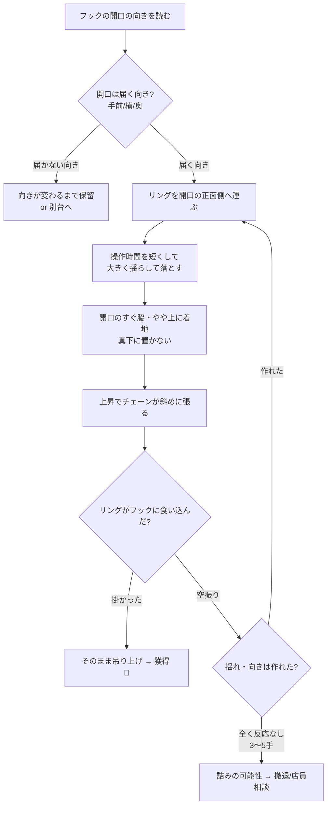

# Oリング・フック設定 攻略ガイド ― 原理から学ぶ

> [!abstract] このノートが扱う設定（重要）
> **筐体側**＝チェーンの先に **Oリング（輪）** がぶら下がっている（＝自分が動かす側）。
> **景品側**＝景品に **フック（鉤）** が固定で付いている（＝動かない的）。
> **筐体のOリングを、景品のフックに引っ掛けられれば一発ゲット**、という設定。
>
> ※「景品にリングが付いていて爪で寄せる」タイプとは原理が逆です。
> 姉妹ノート → [[橋渡し_攻略ガイド]]

> [!tip] 結論を先に（これだけ覚える）
> このゲームの正体は **「振り子（チェーンのOリング）を、フックの“開いた側”に通すゲーム」**。
> しかも **掛かるのは下降時ではなく“引き上げ時”** ―― チェーンが斜めに張ってリングをフックへ引き込む瞬間です。
> だから狙いは **「真下に落とす」ではなく「揺らして上斜めから被せ、上昇の引きで掛ける」**。

> [!warning] 最初に正直なところ
> この設定は **実力で確率は上げられるが、運の比重も大きい**「つり上げ系」です。
> 必勝法はありません。**狙い方の原理を理解して試行回数あたりの成功率を上げる**のがゴール。
> そして **取れない台を見抜いて課金を止める**判断が、上達の半分です。

---

## 1. 🪝 この設定の基本構造

```text
【筐体側＝自分が動かす】          【景品側＝動かない“的”】

   │ チェーン（支点は上）
   │   ↑ ここが振り子の支点
  (O) ← Oリング（揺れる）            ╭─╮  ← フック（景品に固定）
   ┊ 揺れる↔                        │ │
   ┊                          ┌─────┘ └─┐
   ┊                          │   景品    │
   ▼                          └──────────┘

  目標：筐体の (O) を、景品の ╭─╮ フックに通す
       → アームが上がると景品ごと吊り上がって一発ゲット 🎉
```

> [!info] なぜ「一発」なのか
> リングがフックに**1か所でも通れば**、景品はリング↔フックの**点でぶら下がる**状態になります。
> 橋渡しのように「少しずつ寄せる」必要がなく、**掛かった＝持ち上がる**。だから一撃で決まります。
> 逆に言えば、**掛けるまでが全て**のゲームです。

---

## 2. ⚙️ すべての土台になる4つの原理

ここを理解すると、フックの向きやチェーンの揺れを見て「どう動かせば掛かるか」が**自分で導けます**。

### 原理① 点で繋がれば吊り上がる（＝“掛ける”だけに集中していい）

景品側のフックに、筐体側のリングが通れば、それだけで景品はぶら下がります。
**力で掴むのでも、寄せるのでもなく、「リングという輪をフックに通す」一点突破**。

```text
   (O) ← リングが
    │
    ╰─╮ フックの内側に入る
      │ │ → 景品が点で吊られる
   ┌──┘ └──┐
   │  景品  │  アームが上がれば、そのまま獲得口へ
   └────────┘
```

> [!important] だから狙うのは「景品本体」ではなく「フックの開口」
> 景品の重心も、置き方も、ほぼ関係ありません。**フックの“穴”にリングを通せるか**が9割。
> 意識を「景品を動かす」から **「2つの金具を連結する」** に切り替えるのが第一歩。

### 原理② フックの「開いた側」から入れる

フックには **開いている側（鉤の口）** と **閉じた背中側** があります。
リングは **開口からしか入りません**。背中に当てても弾かれて終わりです。

```text
【上 or 横からフックの向きを読む】

  開いた側 ○                背中側 ✗
     ↓                         ↓
    ╭─╮  リングはこの口から      ╭─╮
    │ │  スッと入る             │ │  ← ここに当てても
    ╯ ╰                        ╯ ╰     滑って弾かれる
   フック                      フック
```

> [!note] まず「向き合わせ」
> プレイ前に **フックの開口がどっちを向いているか**（手前／奥／左／右）を必ず確認。
> リングは **開口の正面〜やや上から** 入る軌道で攻めます。向きが合わない位置からは何度やっても掛かりません。

### 原理③ 振り子 ―― “揺れるのはリング側”。これを味方にする

チェーンの先のリングは **振り子** です。支点はチェーンが筐体に付く上端。
このゲームでは **自分が動かす側（リング）が揺れる**のが最大の特徴で、揺れは敵ではなく **「上斜めから被せる」ための武器** になります。

```text
【真下に落とす ✗】          【揺らして上斜めから被せる ○】

    │                            │
   (O)                        (O)→  ← 揺れの勢いで
    ↓ まっすぐ                    ╲      斜めに進入
    ╭─╮ フックの横を              ╭─╮
    │ │ 素通り ✗                 │ │ 開口へ入る ○
```

- 揺れがないと「**ただ上下に上げ下げしているだけのダメパターン**」になりやすい。
- 揺らすと **「上斜めからフックを土台に掛ける動作」** が可能になる。
- **操作時間を短く**してボタンを離すと、**揺れ幅が最大の状態**でリングを落とせる（＝振り子の勢いを使える）。

> [!tip] 揺れの作り方と読み方
>
> - ボタンを離した直後は **大きく左右に揺れる**。狙う方向（奥行き）へは **少し揺れが整ってから** 動かす。
> - 「軽く当てて揺らす → 次の手で開口へ通す」の **2段構え** が安定。
> - 揺れの **戻り際**（リングが的の方へ戻ってくる瞬間）に開口を通過させるイメージ。

### 原理④ 掛かるのは“引き上げ時” ―― ここが最大のキモ

多くの初心者は「下降した瞬間に掛けよう」とします。実際は **アームが上昇する過程**で、
**チェーンが斜めに張り、その張力がリングを横へ引いてフックへ食い込ませる**ことで掛かります。

```text
【①下降：ニアミスでOK】      【②上昇：チェーンが斜めに張る】

   (O)                          ╲(O)   ← チェーンが斜めに突っ張り
    ╭─╮ リングを                  ╲      リングが横＆上へ引かれる
    │ │ フックの開口の             ╭─╮
    │ │ すぐ脇／上に置く           │ │ → 開口にリングが食い込んで
   景品                          景品     ガッチリ掛かる ○
```

- だから **下降位置は「開口のすぐ脇・やや上」** に置くのがコツ。ピタリ真下より、**上昇で引き込まれる余地**を残す。
- **チェーンを斜めにした状態**でフック付近へ当てると、「**持ち上げる際にリングへ引っ掛かりやすい環境**」が作れる。
- 「下降し終えてから持ち上がるときも **上下以外の力**（横方向の張力）が働く」 ―― これを利用するのが上級者。

---

## 3. 🎯 取り方カタログ（手順と「なぜ掛かるか」）

> [!summary] 4つの基本ムーブと使いどころ
> | 技 | ねらい | 向いている状況 |
> |---|---|---|
> | ① 振り子被せ | 揺れの勢いで開口へ上斜め進入 | チェーンが長め・よく揺れる |
> | ② 斜めがけ＋引き上げドラッグ | 上昇の張力でフックへ食い込ませる | 標準的なフック設定の本命 |
> | ③ 開口ねらい（向き合わせ） | フックの開いた側からまっすぐ通す | 開口が手前／横を向いている |
> | ④ 2段構え（揺らして→掛ける） | 1手で揺れ・向きを作り、次手で決める | 1発で掛からない大半のケース |

### ① 振り子被せ（揺らして上斜めから）

**操作時間を短く**してリングを **最大に揺らした状態** で落とし、**揺れの戻り際**にフック開口へ上斜めから被せる。

```text
①短時間操作で大きく揺らす → ②戻り際に開口の真上へ → ③そのまま被せて上昇
   (O)→                        ←(O)                     (O)
    ╲                            ╲                        │掛
   ╭─╮                          ╭─╮                      ╭─╮
   │ │                          │ │                      │┃│ → 掛かる
```

- **なぜ掛かる**：振り子の横移動で、リングが開口の上を **斜めに通過** する瞬間を作れる（[[Oリング・フック設定_攻略ガイド#原理③ 振り子 ―― “揺れるのはリング側”。これを味方にする|原理③]]）。
- **コツ**：真下を狙わない。**開口の向き**に揺れの方向を合わせる。

### ② 斜めがけ＋引き上げドラッグ（本命）

リングをフック開口の **すぐ脇・やや上** に置き、**チェーンを斜めに**したまま上昇させ、張力でフックへ引き込む。

```text
   下降：開口の脇に置く        上昇：斜め張力で食い込む
      (O)                         ╲(O)
       ╲                           ╲
      ╭─╮                          ╭─╮
      │ │ ←ニアミスでOK            │┃│ → ガッチリ ○
```

- **なぜ掛かる**：上昇時にチェーンが斜めに突っ張り、**横方向の力**でリングがフックの開口へ食い込む（[[Oリング・フック設定_攻略ガイド#原理④ 掛かるのは“引き上げ時” ―― ここが最大のキモ|原理④]]）。
- **コツ**：ピタリ真下に置くと上昇で真上に抜けて掛からない。\*\*引き込む“あそび”\*\*を残す。

### ③ 開口ねらい（向き合わせ）

フックの **開いた側が手前や横を向いている**ときは、その正面からリングをまっすぐ通す素直な狙い。

- **手順**：開口の向きを確認 → リングを開口の正面〜やや上に下降 → 上昇で通す。
- **なぜ掛かる**：[[Oリング・フック設定_攻略ガイド#原理② フックの「開いた側」から入れる|開いた側]]から入れば、リングは抵抗なく内側へ。
- **注意**：背中側・閉じた側からは絶対に入らない。位置取りを最優先。

### ④ 2段構え（揺らして → 掛ける）

1発で掛からないのが普通。**1手目で「揺れ」と「フックの向き／位置」を作り、2手目で仕留める**。

- **1手目**：軽く当てて、リングを揺らす／フック側がわずかに動くなら良い向きへ。
- **2手目**：整った揺れと向きに合わせて、①か②で通す。
- **なぜ有効**：止まった状態より、**揺れている状態の方がフックに引っかかりやすい**。

> [!warning] やりがちな失敗
>
> - **真下にまっすぐ落とそうとする** → 揺れも上昇ドラッグも使えず「上下するだけ」。
> - **フックの背中側から当てる** → 何度やっても弾かれる。先に向きを読む。
> - **揺れが完全に止まるのを待つ** → 振り子の武器を捨てている。
> - **掛からない台で粘る** → 後述の[[Oリング・フック設定_攻略ガイド#6. 🚫 取れないフック設定（詰み）パターン|詰みサイン]]を確認して撤退。

---

## 4. 🧭 1プレイの組み立て（どう動かすか）



> [!tip] 1手ごとの“読み”ループ
> **開口の向きを読む → 揺らして上斜めから → 上昇の引きで掛ける → 反応を見て微調整**。
> 掛かる瞬間（上昇時）を意識するだけで、ただ上下させる人から一歩抜けられます。

---

## 5. 💪 台・フック・リングを見抜く

| 見るポイント | 取りやすいサイン | 危険サイン |
|---|---|---|
| **フックの開口** | 手前／横を向いて開いている | 背中側しか狙えない向き |
| **リングの径** | 大きめ＝開口に被せやすい | 小さい＝シビア |
| **チェーンの長さ** | 適度に長く揺らせる | 短すぎ＝振り子が使えない |
| **リング/フックの素材** | 適度に重く・形が崩れない | 軽くフニャフニャ＝制御不能 |
| **アームパワー** | 掛かれば確実に吊り上がる | 掛かっても上げ切れない＝つり上げ不可 |
| **下降・移動制限** | 開口の向きまで寄れる | 届かない・寄れない＝不可 |

> [!note] 「掛かれば一発」でも、上げ切れなければ意味がない
> 引き上げ途中で外れる・上がらない台もあります。\*\*1〜2プレイで「掛かりかけたとき上昇するか」\*\*を観察し、ダメそうなら深追いしない。

---

## 6. 🚫 取れないフック設定（詰み）パターン

> [!danger] このサインが重なったら課金しない
>
> 1. **フックの開口が、寄れない向き（奥・背中側）を向いている**：物理的に通せない。
> 2. **リングが小さい／チェーンが短い**：揺らして被せる余地がない。
> 3. **アームパワーが弱い**：掛かっても吊り上げられない。
> 4. **下降・移動制限がきつい**：開口の正面まで寄れない。
> 5. **リングやフックが軽すぎて制御不能**：揺れがバラついて再現性ゼロ。
>
> **判断基準：負の要素が2つ重なる／3〜5手で“掛かる気配すら無い” → 撤退、または店員に向き直しを丁寧に相談。**

---

## 7. 🪜 初心者の上達ロードマップ

> [!success] ステップアップ
>
> 1. **意識を切り替える**：狙うのは景品本体ではなく **「フックの開口にリングを通す」**
> 2. **掛かる瞬間は“上昇時”** と知る（[[Oリング・フック設定_攻略ガイド#原理④ 掛かるのは“引き上げ時” ―― ここが最大のキモ|原理④]]）
> 3. **操作時間を短く → 大きく揺らして落とす** を体に入れる
> 4. **開口の向き読み**を習慣化（背中側からは入らない）
> 5. **開口の脇・やや上に置いて、上昇の引きで掛ける**②を主力にする
> 6. **詰み台（向きが悪い・リング小・パワー弱）を避ける**判断で課金を抑える
> 7. オンラインクレーンゲームの無料分などで\*\*手数（経験値）\*\*を稼ぐ

---

## 関連

- [[橋渡し_攻略ガイド]] ―― 「重心・支点・てこ」のバランス系。原理の対比に
- [[Oリング・フック設定_攻略ガイド#原理④ 掛かるのは“引き上げ時” ―― ここが最大のキモ|なぜ上昇時に掛かるのか]]
- 振り子・上斜めがけの考え方は、金網設定（網目の「＋」を狙う）にも応用可能

---

> [!quote] 参考
>
> - [ココアオレのオンクレブログ ― S字フック・釣り攻略（揺らし方・引き上げ掛け）](https://grabbit.co.jp/onkure/hook/)
> - [毎日がクレーンゲームパーティープラス ― S字フック・リング台のコツ・攻略まとめ](https://crane-game-party.cgp-corp.co.jp/fook/)
> - [Lemon8 ― リングを引っ掛ける2つのコツ（滑り込ませ／揺らして外掛け）](https://www.lemon8-app.com/@nakachin262737/7553608309119861255?region=jp)
> - [フック戦長(note) ― フック設定攻略メモ 基礎編①（基本的な動きとリングの形）](https://note.com/clear_quokka6739/n/nc857937ac061)
> - [元ゲーセン店員のブログ ― つり上げ系は運ゲーだが確率は上げられる](https://arcadegame-ishida.com/2019/01/11/post-974/)
> - [ラジオライフ ― フックとDリングで攻略法を変える](https://radiolife.com/tips/4634/)
> - [セガプラザ ― 缶バッジ（リング付き）の取り方・コツ](https://segaplaza.jp/special/ufo/tips-of-getting-prize-badge-ring/)
