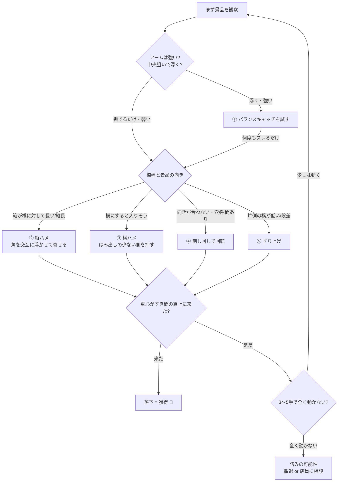

# 橋渡し攻略ガイド ― 原理から学ぶ

> [!abstract] このノートのゴール
>
> - 「どこを狙うか」だけでなく **なぜそこを狙うと取れるのか** を理解する
> - 景品の置かれ方を見て「どの取り方を選ぶか」を自分で判断できるようになる
> - **取れない（詰み）台を見抜いて、ムダ課金を防ぐ**

> [!tip] 結論を先に（これだけ覚える）
> 橋渡しは **「景品の[[橋渡し_攻略ガイド#重心（じゅうしん）|重心]]を、2本の橋のすき間の真上へ運ぶ」** ゲーム。
> そのために **真ん中ではなく“端・角”を狙って、橋を支点にじわじわ回転・移動させる**。
> これがすべての技に共通する原理です。

---

## 1. 🌉 橋渡しとは（基本構造）

2本の平行な棒（＝**橋／バー**）の上に、箱モノなどの景品が**またがって**乗っている設定です。橋と橋の **すき間** に景品を落とせば獲得。

```text
【真上から見た図】              【手前から見た断面図】

      ＜奥＞                     ┌────────────┐
 ┃          ┃                   │    景品     │  ← 箱が橋に乗る
 ┃ ┌──────┐ ┃                   └─┬────────┬─┘
 ┃ │      │ ┃                ▆▆▆▆▆          ▆▆▆▆▆
 ┃ │ 景品 │ ┃  ┃=橋(2本)     左橋  ↑ すき間 ↑  右橋
 ┃ │      │ ┃                      └─落とし穴─┘
 ┃ └──────┘ ┃   景品は左右       （ここに落とせば獲得！）
 ┃          ┃   2本にまたがる
      ＜手前＞
```

> [!info] 橋の3パターン（最初に見分ける）
>
> - **平行**：左右の橋が等間隔。一番素直。基本技が通る。
> - **末広がり（ハの字）**：奥または手前に向かって幅が広がる。広い側を使う。
> - **非対称・段差**：片方の橋が高い／低い。[[橋渡し_攻略ガイド#⑤ ずり上げ|ずり上げ]]のチャンス。

---

## 2. ⚙️ すべての土台になる3つの原理

ここを理解すると、未知の配置でも「どこを狙えばいいか」が**自分で導けます**。

### 重心（じゅうしん）

景品の**重さが集中している1点**。景品全体の重さは、この点にぶら下がっていると考えてOK。

> [!note] なぜ重要か
> 今のクレーンゲームは「重心をいかに扱うか」のバランスゲーム。**重心の位置が読めるかどうかで、獲得までの投資額が大きく変わります。**

**重心の見つけ方（観察で読む）**

1. **ド真ん中を1回狙ってみる** → 景品の反応を見る
2. 反応から重心を推測する：

```text
 ・真上に少し浮いて戻った  → 重心はほぼ中央
 ・奥だけ浮いて手前が残った → 手前が重い（重心が手前寄り）
 ・右に傾いた               → 右が重い（重心が右寄り）
```

3. 次の1手は、読んだ重心に合わせて狙いを微調整する

### 支点（してん）＝橋

景品が橋に触れている線が **支点（回転の軸）** になります。橋渡しでは支点は基本 **2本（＝2点支え）**。

> [!important] 落下の絶対条件
> **重心が「2つの支点の内側」にある間は安定（落ちない）。
> 重心が「支点の外側」へ出た瞬間に、重力で傾いて落ちる。**

```text
【安定】落ちない                    【不安定】落ちる
重心●が2つの支点の“内側”            重心●が支点の“外”に出た瞬間

   ┌──────────┐                      ┌──────────┐
   │    ●     │                      │        ●╲│ ← 傾く
   └─┬──────┬─┘                      └──────┬───┘
 ▆▆▆▆╧▆  ▆╧▆▆▆▆                    ▆▆▆▆▆▆  ▆╧▆▆▆▆
     支点   支点                            支点
   ●は支点の間 → 安定                ●が右支点を越える → 右へ落下
```

→ つまり攻略とは **「重心を支点の外（＝すき間側）へ追い出す」or「重心ごと持ち上げる」** ことだと分かります。

### てこ・回転モーメント

支点（橋）から離れた**端や角**にアームの力を加えると、支点を軸に景品が**回転**します（てこの原理）。これが「**真ん中より端を狙え**」の正体です。

```text
✗ 中央を狙う                         ○ 端（角）を狙う
        ▼ツメ                                ▼ツメ
   ┌────┴────┐                         ┌───────┴┐
   │   景品   │                         │ 景品  ◤ │ ← 片側だけ持ち上がる
   └─┬─────┬─┘                         └─┬─────┬─┘
 ▆▆▆▆╧▆  ▆╧▆▆▆▆                       ▆▆▆▆╧▆  ▆╧▆▆▆▆
 左右が均等に上がるだけ                  支点を軸に「回転」する
 → 真上に上がって元の位置に戻る          → 毎回ちょっとずつズレ／浮きが残る
 → いくら粘っても進まない                → 積み重ねで重心がすき間へ近づく
```

> [!tip] 「フチ（角）」は最強のテコ
> ツメが景品の**フチ・角に引っかかる**と、アームパワー以上に大きく動きます。支点から一番遠い角は、最も少ない力で大きく回転させられる“てこの先端”だからです。

---

## 3. 🎯 取り方カタログ（狙い所と「なぜ取れるか」）

> [!summary] 5つの基本技と使いどころ
> | 技 | ねらい | 向いている状況 |
> |---|---|---|
> | ① バランスキャッチ | 重心ごと持ち上げて運ぶ | アームが強い／景品が軽い／重心が中央 |
> | ② 縦ハメ | 短辺をすき間に落とし込む | 箱が橋に対して長い・縦長 |
> | ③ 横ハメ | 横向きにしてすき間へ倒す | 横にすると入る幅・薄めの箱 |
> | ④ 刺し回し | 回転させて向きを変える | フィルムなし・ツメが入る穴がある |
> | ⑤ ずり上げ | 段差を使い片側を上げる | 片方の橋が低い／非対称・段差台 |

### ① バランスキャッチ

**重心を真上から挟んで、景品ごと持ち上げて穴へ運ぶ**ストレートな取り方。決まれば1発。

```text
【断面図】
      ▼▼ アームを重心の真上に
   ┌──┴┴──┐
   │  ●   │ ← 重心をツメで挟む
   └─┬──┬─┘
 ▆▆▆▆  ▆▆▆▆   持ち上げ力が重心を支えられれば
   左橋  右橋   そのまま浮いて運べる
```

- **なぜ取れる**：ツメが重心の真上を挟めば、左右のバランスが崩れず、てこの力で重心ごと浮く。
- **狙い**：まず縦横とも**ド真ん中**。傾いたら重心側へ寄せて再挑戦。
- **向く景品**：箱モノ（ぬいぐるみより有利）／底が地面と平行／軽め。

> [!warning] 注意
> 対策台（重い・アームが弱い・撫でるだけ）では通用しない。**3回やって毎回ズレるだけなら別の技へ切り替え**。

### ② 縦ハメ

箱が橋幅より長いとき、**左右の角を交互に浮かせて“歩かせ”、短辺をすき間に落とし込む**技。橋渡しの王道。

```text
【真上から：左右の角を交互に攻める】
①平置き        ②左奥角を寄せる   ③右手前角を寄せる   ④縦長にハマる→落下
┃ ┌──┐ ┃      ┃┌──┐ ┃        ┃ ┌─┐ ┃          ┃┌┐ ┃
┃ │箱│ ┃ →    ┃│箱│↘┃ →      ┃ │箱│ ┃ →        ┃││ ┃ → 落
┃ └──┘ ┃      ┃└──┘ ┃        ┃ └─┘ ┃          ┃└┘ ┃
```

- **狙い**：浮いている角の **対角線上の角** を片アームで狙い、左右交互にズラす。
- **なぜ取れる**：1回ごとに片角が支点から外れ、回転＋移動が少しずつ蓄積。やがて短辺がすき間に落ち込み、重心が穴の上に乗って落下する。
- **初期位置のコツ**：クレーンが**奥すぎると詰まりやすい**。手前寄りスタートが有利。

### ③ 横ハメ

箱を**横向きに寝かせて**、はみ出しの少ない側からすき間へ倒し込む。初心者の超ド定番。

```text
【断面図：はみ出しの少ない側を押し続ける】
        ▼ 右アームで橋に近い角(×)を狙う
   ┌────×┐
   │ 景品 │
   └─┬───┘
 ▆▆▆▆  ▆▆▆▆▆     片側の支えを外す → 重心が右橋を越える
 左橋   右橋        → 横向きにすき間へ倒れて落下
```

- **狙い**：**橋からはみ出している部分が少ない側の角（×）** を、橋ギリギリで狙う。同じ点を狙い続ける。
- **なぜ取れる**：片側の支点を外すと支えが1点になり、重心が残った支点の外へ出て倒れ込む。
- **向く条件**：滑り止めがキツくない／景品が比較的重い／引っかかりが浅い／横にすると入る幅。

### ④ 刺し回し（ぶっ刺し）

ツメを**景品の穴・箱の合わせ目・隙間に差し込み**、アームの開閉で景品を**回転**させて、すき間に通る向きへ変える。

```text
【真上から】
   ┌──────┐            ┌────┐
   │ 箱  ↻│  ツメで    │箱 ↻│ 向きが変わり
   │   ●  │  回転 →    │  ● │ すき間に通る向きに
   └──────┘            └────┘
```

- **なぜ取れる**：差し込んだツメが回転の支点になり、重心を軸にして向きを変えられる。長辺がすき間と平行→直交へ変えて落とす狙い。
- **使えない条件**：景品に**フィルム巻き**（ツメが滑って引っかからない）。

### ⑤ ずり上げ

片方の橋が**低い／段差がある**台で、低い側へ景品を**ずり上げて**片側を持ち上げ、すき間へ滑り込ませる。

```text
【断面図：左右で高さが違う橋】
   ┌──────┐
   │ 景品 ╱│ ← 高い橋側の角を持ち上げ、
   └─┬──╱─┘    低い側へずらしながら落とす
 ▆▆▆▆   ▁▁▁▁
 高い橋   低い橋
```

- **なぜ取れる**：段差が「てこの支点」になり、低い側へずらすほど重心が低い橋の外へ抜けやすくなる。
- **向く台**：非対称・末広がり・片側にチューブが無い等。

### ⑥ 押し／すべり落とし（おまけ）

- **押し**：すき間や獲得口からはみ出した部分をツメで**押して**落とす。手前配置で有効。
- **すべり落とし**：橋に乗った景品を滑らせて、橋と橋の間へ落とす。滑り止めが弱い台向き。

---

## 4. 🧭 配置の読み方（どの技を選ぶか）



> [!tip] 1手ごとの“読み”ループ
> **狙う → 動きを観察 → 重心を更新 → 次の狙いを微調整**。この繰り返しが上達の本体。クレーンゲームに唯一の正解はなく、反応を見て技を切り替える柔軟さが効きます。

---

## 5. 💪 アームの強さ・台を見抜く

| 見るポイント | 強い／取りやすいサイン | 弱い／危険サイン |
|---|---|---|
| ツメの間隔 | 狭い＝パワーが入っている傾向 | 広すぎ＝寄せが効きにくい |
| ツメの形 | 適度に曲がっている＝引っかけやすい | ねじれ／真っ直ぐすぎ＝難度↑ |
| 中央を1回試す | 景品が浮く・大きく動く | 撫でるだけ＝持ち上げ系は捨てる |
| 橋幅 | 横にすると入りそう＝横ハメ可 | 縦でも横でも挟まる＝物理的に不可 |

---

## 6. 🚫 取れない橋渡し（詰み）7パターン

> [!danger] このサインが重なったら課金しない
>
> 1. **橋幅が狭すぎる**：縦でも横でも挟まり、物理的に通過不可。
> 2. **橋にチューブ（特にピンク）**：強力な滑り止め。景品が張り付いて動かない。
> 3. **末広がり＋チューブ＋斜めハメ**の合わせ技：必要回数が激増。
> 4. **景品が極端に左右へ寄せ置き**：アームの移動限界で最後に届かない。
> 5. **斜め置き・上下逆置き**：重い部分が下で持ち上がらない向き。
> 6. **クロス状（平行でない）橋**：間にハマって抜けなくなる。成功例が極端に少ない。
> 7. **フィルム巻き**：ツメが滑り、刺し回し等が封じられる。
>
> **判断基準：「ピンクチューブ＋フィルム」など負の要素が2つ重なる／3〜5手で全く動かない → 撤退か店員に置き直し相談**（文句からではなく丁寧に）。

---

## 7. 🪜 初心者の上達ロードマップ

> [!success] ステップアップ
>
> 1. **原理を頭に入れる**（[[橋渡し_攻略ガイド#2. ⚙️ すべての土台になる3つの原理|重心・支点・てこ]]）
> 2. **中央1回→反応観察**で重心を読む癖をつける
> 3. まずは **横ハメ** を1つ完璧にする（最も再現性が高い）
> 4. 次に **縦ハメ**（角を交互に寄せる）を覚える
> 5. **詰み台を見抜いて避ける**判断力を磨く（これが課金額を一番下げる）
> 6. オンラインクレーンゲームの無料分などで\*\*手数（経験値）\*\*を稼ぐ

---

## 関連

- [[橋渡し_攻略ガイド#1. 🌉 橋渡しとは（基本構造）|橋の3パターンの見分け]]
- 重心の考え方は他設定（タワー・末広がり）にも応用可能

---

> [!quote] 参考
>
> - [キュリオス.INFO ― 橋渡し箱もの完全攻略](https://curiousvv.jp/post-984/)
> - [キュリオス.INFO ― 横ハメの落とし方](https://curiousvv.jp/cranegame-hashiwatashi-yoko/)
> - [キュリオス.INFO ― バランスキャッチ](https://curiousvv.jp/cranegame-balancecatch/)
> - [キュリオス.INFO ― 取れない橋渡しの特徴7選](https://curiousvv.jp/cranegame-hashiwatasi-torenai/)
> - [キュリオス.INFO ― 重心について](https://curiousvv.jp/cranegame-centerofgravity/)
> - [ココアオレのオンクレブログ ― 橋渡し台のコツ（横ハメ・縦ハメ）](https://grabbit.co.jp/onkure/bridging/)
> - [ダガンガドール ― 橋渡しコツ・実例紹介](https://dagangadoll.com/kurege-figure-hashiwatashi-tips/)
> - [iwanablog ― 橋渡し台の取り方のコツ](https://iwanablog.net/cranegame-hasiwatasi-torikata/)
> - [スマくれ ― 攻略例231（重心が奥側の縦ハメ）](https://smacre.jp/cranegame-capture-case-231/)
